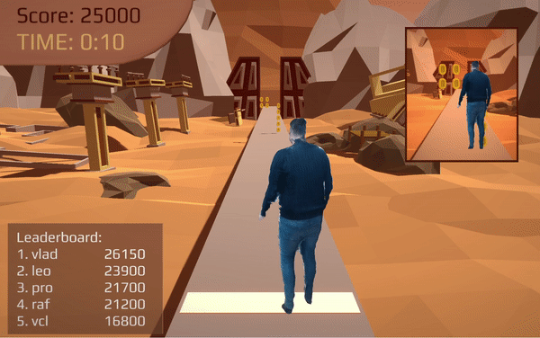
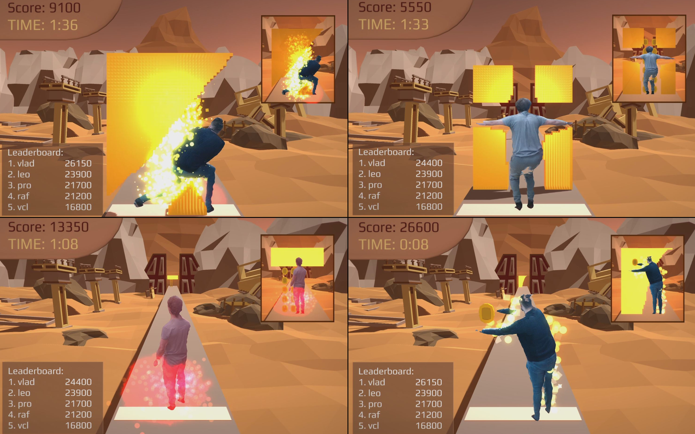
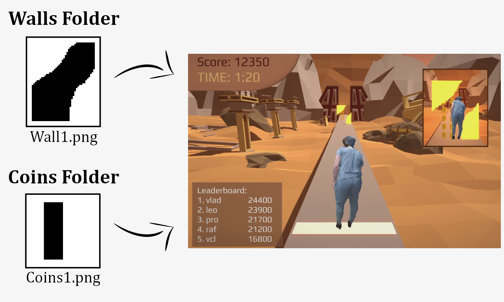

  
  

  
  

# Overview
__AVoidX__ is an Augmented Visuality singleplayer obstacle avoidance game. Players try to avoid collisions with incoming carved walls by moving their actual bodies inside a capturing space perimetrically covered by four sensors, generating a real-time 3d reconstruction of their physical model. Players' aim is to reach the highest possible score as they earn points by successfully avoiding the walls and gathering virtual coins by striking appropriate poses.

  

## Description

### Player's model live 3d reconstruction

### Real-time Responsive Mesh Collider
The system used to evaluate the player's in-game progress is collision based. For every object moving towards the player, either it is a wall or a coin, a set of collision checks takes place as soon as it reaches the player, to determine whether it has hit him or not. Collisions are driven by the player’s volumetric representation instead of higher level metadata or projection-based techniques. The collision system described above is implemented by applying a responsive Mesh Collider to the player's 3d reconstruction that utilizes the reconstruction's volumetric data in real time.

### Two cameras for better game control
In order to grant user better control over the game, there are two different cameras designed to capture and display the game events from different aspects at the same time. Except from the main camera, there is also an orthographic camera whose capture is displayed on the top right corner of the game screen, used to provide player with more information about his relative position over the objects moving towards him. In that direction, motion control is added to the game's main camera, forcing it to smoothly change into a behind-the-player view as the walls gradually come closer to him, contributing to maximum game control.

### Easy Wall and Coins Collection Modification
The game mechanism relies on a variation of walls and coin collentions moving towards the player. These walls and coin collections generated throughout the game are everytime randomly picked from a larger group of walls and coin collections available, predifined by the user. Each wall is generated by a 40x50 grid, represented by a black and white 40x50 png image, and the same applies to coin collections, that are generated by black and white 6x6 png images. These png files are imported during game's initialization, allowing the player to easily modify the walls/coins collections available for the game later on.

  

### Up to date Leaderboard display throughout game
As mentioned above, player's aim is to reach the highest possible score by successfully avoiding walls and gathering coins. In order to provide users a better interpretation about their in-game progress, except from their real time score display, there is also a Leaderboard available on the bottom left corner of the game screen, on where the players with the best scores yet, as well as their scores, are displayed throughout the game.
