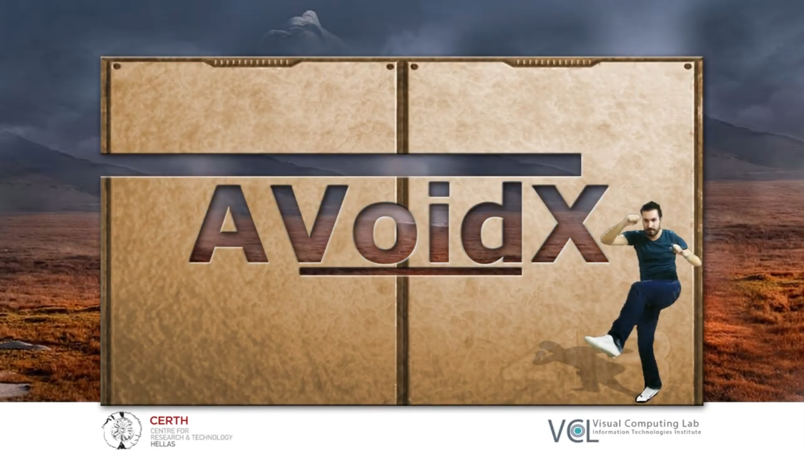

  

# Overview
__AVoidX__ is an Augmented Visuality singleplayer obstacle avoidance game. Players try to avoid collisions with incoming carved walls by moving their actual bodies inside a capturing space perimetrically covered by four sensors, generating a real-time 3d reconstruction of their physical model. Players' aim is to reach the highest possible score as they earn points by successfully
avoiding the walls and gathering virtual coins.

  

